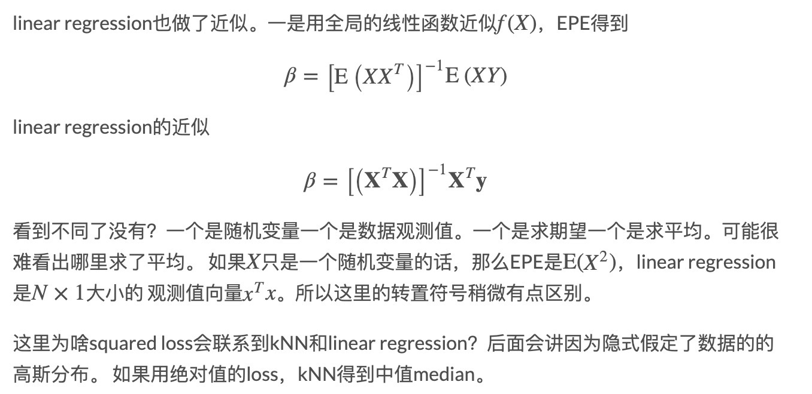

---

---

[TOC]

<!-- toc -->

# 第二章 监督学习综述

## 2.1 简介

Supervised learning:the goal is to use the **inputs** to predict the values of the **outputs**

- Inputs: predictors/independent variables

- Outputs:responses/dependent variables 

##  2.2 变量数据类型

Outputs:

- regression--quantitative：定量
- classification--qualitative：定性 categorical/discrete/factors

Inputs:

- ordered categorical

处理多类别的定性变量，通常用**虚拟变量(dummy variables)**来编码。

记号说明：

- 输入：*X*，$$X_{j}$$代表第j个特征
- 输出：*Y(定量)*，*G(定性)*，$$\hat{Y}$$ 预测值
- 观测值（样本）：$$x_i$$代表第i个样本

## 2.3 最小二乘法(Least Squares) 和 最近邻居法(Nearest Neighbors)

### 2.3.1 线性模型和最小二乘法

线性模型(*linear model*)：

给定一组输入$$X^T = (X_1, X_2, X_3,….X_p)$$,通过如下模型预测Y：
$$
\hat{Y} = \hat{\beta_0} + \sum_{j=1}^{p}X_j\hat{\beta_j}
$$
其中，$$\hat{\beta_0}$$是截距(*intercept*)，在ML里面也叫*bias*。通常把$$\hat{\beta_0}$$当做常量1的系数，上式将简化为：
$$
\hat{Y} = X^{T}\hat{\beta}
$$
利用残差平方和(*residual sum of squares*)来fit模型：
$$
RSS(\beta) = \sum_{i=1}^{N}(y_i - x_i^T\beta)^2
$$
由于$$RSS(\beta)$$是二次函数(*quadratic function*)，因此一定存在最小值，但是可能不唯一。可以将$$RSS(\beta)$$写成如下形式
$$
RSS(\beta) = (Y - X\beta)^T(Y - X\beta)
$$
对$$\beta$$求导数可得**Normal equation**
$$
X^T(Y - X\beta) = 0
$$
若$$X^TX$$非奇异(*nonsingular*)，则$$\beta$$有唯一解：
$$
\hat{\beta} = (X^TX)^{-1}X^TY
$$

### 2.3.2 最近邻居法

*k-NN*算法:找到距离*x*最近的k个观测值来表示$$\hat{Y}$$:
$$
\hat{Y}(x) = \frac{1}{k}\sum_{x_i \in N_k(x)}y_i
$$
其中：$$N_{k}(x)$$表示在训练集中距离$x$最近的$$k$$个点$$x_i$$的集合。

从算法可以得知，随着k的增大，k-NN在训练集上的误差将逐渐增大。特别地，如果$$k = 1$$，此时在训练集上的误差为0。

**the effective number of parameters of k-nearest neighbors is N/k**

- effective number：又名Degree of Freedom, 或VC-Dimension

参考文献:https://libingchen.me/blog/esl/featured/2018/08/05/ESLII-5-Effective-Number-KNN/

### 2.3.3 从最小二乘法到NN

- 最小二乘法：低方差，高偏差，依赖决策边界
- k-NN：依赖输入，不稳定，高方差和低偏差

*—————待续-----------*

## 2.4 统计决策理论

设$$X \in \mathbb{R}^P$$,$$Y \in \mathbb{R}$$,X和Y的联合概率分布(*joint distribution*)为$$P(x,y)$$，损失函数(*Loss function*)为$$L(Y,f(X))$$，假设为平方误差损失(*squared error loss*):
$$
L(Y,f(X)) = (Y-f(X))^2
$$
预测误差的期望(*expected (squared) prediction error*)为：
$$
EPE(f) = E(Y-f(X))^2 \\ 
        = \int[y-f(x)]^2P(dx,dy)
$$
根据条件概率公式 $P(X,Y) = P(Y|X)P(X)$, $P(Y|X) = P(Y,X)/P(X)$,

$$
EPE(f) = E_XE_{Y|X}([y-f(x)]^2|X)
$$
https://stats.stackexchange.com/questions/92180/expected-prediction-error-derivation

最终得到
$$
f(x) = E(Y|X=x)
$$
对于每个点预测，把和它X向量取值一样的样本点都找出来，然后取他们的平均值就可以了。

k-NN的近似$$\hat{f}(x) = Avg(y_i | x_i \in N_k(x))$$,对上式做了两个近似：

- 用平均值取代期望
- 用邻域取代了X

对于线性回归，假设$$\hat{f}(x) = x^T\beta $$ ,可以解得
$$
\beta = [E(XX^T]^{-1}E(XY)
$$

[http://xuewei4d.github.io/machinelearning/notes/esl-chapter2/](http://xuewei4d.github.io/machinelearning/notes/esl-chapter2/)

[绝对值的loss相关](https://math.stackexchange.com/questions/508412/optimal-solution-for-expected-absolute-loss-function)

## 2.5 维数灾难(*curse of dimensionality*)
